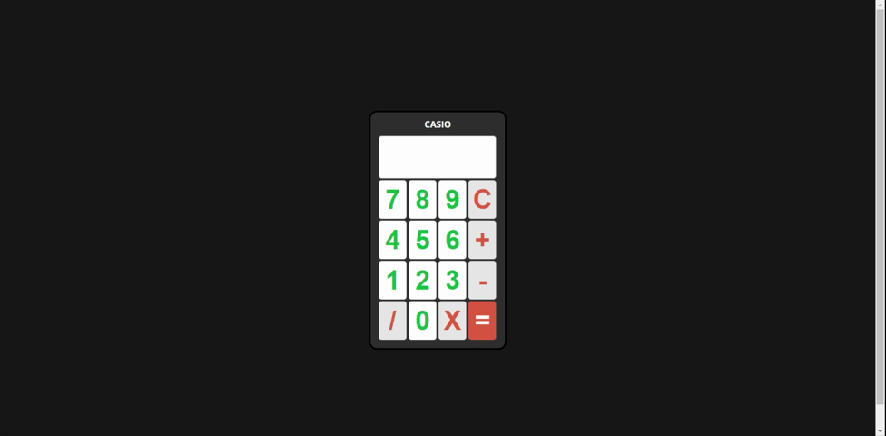

# Calculadora simples e funcional utilizando HTML, CSS e JavaScript
https://christyschott.github.io/calculadoraSimples.github.io/

#### Origem

Essa calculadora foi projetada e apresentada no seguinte vídeo no youtube: https://youtu.be/YjfyaaEnjrg. 
Para a ver a versão específica do vídeo sem as contribuições da comunidade, [click aqui](https://github.com/queroserprogramador/calculadora/tree/072bd72973c9d4918a6f896662f308984d6a1e1a)

#### Tecnologias usadas
* Javascript 
* CSS3 
* HTML5 

#### Como rodar o projeto

Basta abrir o arquivo index.html em qualquer navegador web.
